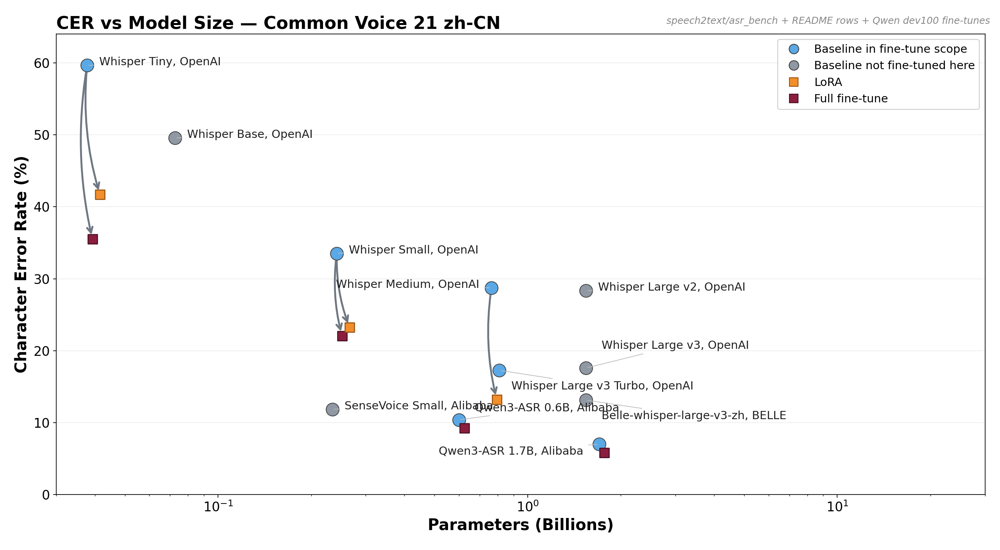
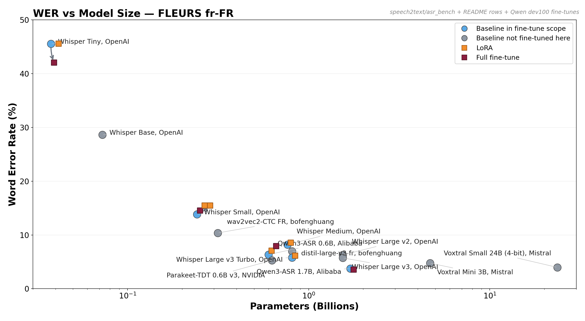

# Fine-Tuning Efficient Chinese Speech Models beyond the Pareto Frontier

This repo asks a narrow question under a strict compute budget: **when does
speech fine-tuning actually buy you something, and when does a strong baseline
already dominate?**



Take-homes before details:

1. **Fine-tuning is not a universal win.** On `zh-CN` it helps decisively; on
   `fr-FR` it often regresses once the base model is already strong.
2. **Model size and data overlap matter more than adapter choice alone.**
   Tiny still has headroom on French; small/medium/turbo mostly do not.
3. **The right first step under a small budget is a baseline sweep, not blind
   SFT.** Gap-to-ceiling is the main diagnostic signal in this repo.
4. **Qwen3-ASR and Granite were added as counterpoints, not just extra rows.**
   They show how much the conclusion depends on backbone quality, pre-training
   mix, and the evaluation slice.

This repo bundles four tracks under one roof: the original Whisper
fine-tuning work, the `asr_bench` baseline benchmark, the Qwen3-ASR pilot, and
the Granite Speech pilot. The earlier zh-CN Whisper run lives intact under
`archive_zh/`; the present fr-FR Whisper run is in `outputs/`. Tiny was added
later to control for the *gap-to-ceiling* effect discussed in §3.3.

The benchmark plots now include Qwen3-ASR `0.6B` and `1.7B` baseline and
fine-tune points on fixed `dev100` slices, and Granite points will be reported
on that same reduced slice for apples-to-apples overlay. The main `asr_bench`
curves remain the original benchmark runs; the overlays are for directional
comparison rather than strict leaderboard ranking.

## TL;DR

| Size | zh-CN (CV21) baseline / best FT (Δ rel) | fr-FR (FLEURS) baseline / best FT (Δ rel) |
|---|---|---|
| **tiny** | CER 59,4 % → **35,5 %** (full FT, **−40,2 %**) | WER 45,5 % → **42,1 %** (full FT, **−7,5 %**) |
| small    | CER 33,5 % → **22,1 %** (full FT, **−34,1 %**) | WER 13,9 % → 14,6 % (full FT, **+5,0 %**) |
| medium   | CER 28,7 % → **13,2 %** (LoRA, **−54,0 %**)    | WER 8,20 % → 8,59 % (LoRA, **+4,8 %**) |
| turbo    | n/a                                            | WER 5,81 % → 6,17 % (LoRA, +6,2 %) |

Same code, same recipe family, same sub-sampling protocol. Three patterns:

1. **Sign flips with the language at small/medium.** zh fine-tunes help by
   30–54 %. fr fine-tunes hurt by 5 % at the same scale.
2. **At tiny, both languages benefit from fine-tuning** — fr full FT
   improves WER by 7,5 % too. Tiny is small enough that the baseline has
   not saturated FLEURS, so there is real gap to close.
3. **Best result on fr is `Whisper-large-v3-turbo` *baseline* — no
   fine-tune** — at WER 5,81 %. It even beats `whisper-large-v3-french-distil-dec4`
   (6,97 % zero-shot), a model specifically distilled for French.

The mechanism is **gap-to-ceiling × pre-training distribution overlap**:

* **Common Voice 21 zh-CN** → Whisper-v3 has weak zh coverage, CV's
  voluntary-recorded distribution differs from the SFT mix → gap to close at
  every size → fine-tuning closes it (−30 to −54 % CER).
* **FLEURS fr-FR at small/medium/turbo** → French is one of Whisper's
  strongest languages and FLEURS-style content is heavily represented in
  Whisper-v3's SFT mix → no gap to close → fine-tuning adds noise.
* **FLEURS fr-FR at tiny** → tiny has not absorbed enough of Whisper's
  multilingual corpus to saturate FLEURS-fr → real gap → full FT helps.

> **The take-away that matters more than the numbers:** *fine-tuning helps
> when (target distribution is poorly covered) OR (the model is small enough
> that it has not saturated the data even if covered).* A fine-tuner under
> compute constraint should test this first, before spending the GPU budget.

A second hypothesis follows directly (cf. §5): **our recipe is sub-optimal for
in-distribution data.** If the authors had merged a copy of FLEURS-fr into
Whisper-v3's pre-training with their original recipe, the model wouldn't have
regressed. Our high-LR / small-batch / single-dataset / no-SpecAugment recipe is
calibrated for picking up *new* distributions; on already-seen data it produces
drift instead of staying at the equilibrium. So the regression on French is
*partly* a recipe diagnostic, not just a "no signal in the data" verdict.

A live Gradio server (`bash scripts/start_demo.sh`) lets you record / upload audio
in your browser and compare baseline vs fine-tuned side-by-side.

## Repo layout

```
.
├── README.md                       # this file
├── asr_bench/                      # baseline benchmark + comparative plots
│   ├── plot.py
│   ├── preds/
│   └── figures/
├── Qwen3-ASR/                      # Qwen3-ASR codebase + finetuning runs
│   ├── finetuning/
│   └── qwen_asr/
├── granite_speech/                 # Granite Speech finetuning + eval helpers
│   └── finetuning/
├── archive_zh/                     # zh-CN run, preserved
│   ├── README.zh.md
│   ├── metrics.json                # 5-row zh table
│   ├── error_analysis.json
│   └── preds/                      # 5 prediction JSONs
├── requirements.txt
├── src/
│   ├── data.py                     # FLEURS fr_fr load → cast 16 kHz → filter → features+labels
│   ├── train.py                    # CLI: --mode lora | full | scratch
│   ├── eval.py                     # generation + WER/CER on test split
│   ├── analyze.py                  # results table + worst-100 error bucketing
│   ├── render_table.py             # metrics.json → Markdown table
│   ├── train_w2v.py                # alt paradigm: wav2vec2 / XLS-R + CTC head
│   ├── eval_w2v.py                 # CTC eval helper
│   └── server.py                   # Gradio (mic + upload, baseline vs fine-tuned)
├── scripts/
│   ├── run_phase_tiny.sh           # whisper-tiny fr : baseline + LoRA + full FT
│   ├── run_phase_tiny_zh.sh        # whisper-tiny zh-CN : baseline + LoRA + full FT
│   ├── run_phase_a.sh              # whisper-small : baseline / LoRA-zh recipe / full FT / scratch
│   ├── run_phase_a2.sh             # whisper-small + LoRA "fr recipe" (LR 3e-5, 2 ep) — corrective
│   ├── run_phase_b.sh              # whisper-medium : baseline + LoRA (LR 5e-5, 2 ep)
│   ├── run_phase_c.sh              # whisper-large-v3-turbo : baseline + LoRA (LR 5e-5, 2 ep)
│   ├── run_phase_d.sh              # zero-shot refs: bofenghuang wav2vec2-fr CTC + whisper-fr-distil
│   ├── run_phase_e.sh              # (optional) whisper-large-v3 1.55B + LoRA, needs bnb 4-bit
│   ├── run_all_phases.sh           # A → B → C → analyze
│   ├── run_post.sh                 # post-pipeline: A2 + D + analyze + render_table
│   ├── quick_summary.sh            # one-liner WER/CER over outputs/preds
│   └── start_demo.sh               # launches Gradio
└── outputs/
    ├── preds/                      # 17 prediction JSONs (fr + zh-tiny)
    ├── adapters/                   # LoRA weights, full-FT and scratch checkpoints
    ├── logs/                       # stdout per step
    ├── metrics_fr.json             # 14 fr rows
    ├── metrics_zh.json             # 8 zh rows (3 new tiny + 5 from archive)
    ├── table_fr.md                 # rendered fr table
    ├── table_zh.md                 # rendered zh table
    └── error_analysis_fr.json
```

## 1. Datasets

### 1.1 zh-CN

Common Voice 21 zh-CN via the parquet rehost
[`keeve101/common-voice-21.0-2025-03-14-zh-CN-split`](https://huggingface.co/datasets/keeve101/common-voice-21.0-2025-03-14-zh-CN-split).
Read speech, ~3-7 s per clip, 32 kHz mp3 cast to 16 kHz mono. We sub-sampled
4 000 train / 300 dev / 500 test. Heavy long-tail vocabulary (place names,
historical text). Full description: `archive_zh/README.zh.md`.

### 1.2 fr-FR

**FLEURS** sub-corpus `fr_fr` via `google/fleurs`. Read speech, 16 kHz mono out
of the box, transcripts already lowercased and stripped of punctuation
(FLEURS-standard `transcription` field). Splits: 3 193 train / 289 dev / 676
test → sub-sampled to 3 193 / 289 / **500**. Train volume **10,32 h**, mean clip
11,6 s (3,8–29,4 s), 24,1 words per sentence on average.

Why not Common Voice fr? CV21-fr is huge (≥ 100 GB streamed). FLEURS-fr is the
exact "few hours of audio" the spec asks for, with cleaner splits, and is the
standard FLEURS leaderboard entry — directly comparable to published numbers.

**Whisper feature extractor / tokenizer is bit-identical between small and
medium** (80-bin mel, 51 865-token vocab) → encoded `processed/` is reused
between Phase A and Phase B (saves ~5 min). Whisper-large-v3-turbo uses 128-bin
mel + 1 extra vocab token → Phase C re-encodes.

## 2. Models, recipes, and rationale

### 2.0 Two-pass recipe — why

We ran the test in two passes:

1. **"zh recipe"** (LR 1e-4 LoRA, rank 32, 1 epoch, warmup 10 %) — the recipe
   that worked on Chinese. Applied to the small-model French run as the
   first-cut.
2. **"fr recipe corrected"** (LR 5e-5 LoRA, 2 epochs) — applied to medium and
   turbo after we observed the small fine-tune *regressed*. We also re-ran small
   with LR 3e-5 / 2 epochs (`lora_small_v2`) to test whether the corrected
   recipe rescues small.

Both recipes regress on French (cf. §3). On Chinese the zh recipe wins clearly.

### 2.0b Phase Tiny — Whisper-tiny (39 M) on both languages

The smallest pre-trained Whisper. Three variants per language (fr-FLEURS,
zh-CV21), identical recipes side-by-side:

| Variant | Init | Trainable | What |
|---|---|---:|---|
| `baseline_tiny[_zh]` | OAI pre-trained | 0 | no fine-tune |
| `lora_tiny[_zh]` | OAI pre-trained | 1,5 M (~3,8 %) | LoRA q/k/v/out_proj enc+dec, LR 1e-4, 1 ep |
| `full_tiny[_zh]` | OAI pre-trained | 39 M (100 %) | full FT, LR 1e-5, 1 ep |

Tiny is the cleanest test of the **gap-to-ceiling** hypothesis (cf. §3.3): on
a small under-trained backbone, baseline WER/CER is far from the model's
plateau, so any well-calibrated fine-tune has real headroom to fill — even on
in-distribution data. We expected (and observe) that the recipe regression
seen at small/medium/turbo *disappears* at tiny because the model has not
saturated the data distribution yet.

### 2.1 Phase A — Whisper-small (244 M) test bench

Four variants on identical data, identical seed:

| Variant | Init | Trainable | What |
|---|---|---:|---|
| `baseline_small` | OAI pre-trained | 0 | no fine-tune |
| `lora_small` | OAI pre-trained | 7,1 M (~ 2,8 %) | LoRA q/k/v/out_proj enc+dec |
| `lora_small_v2` | OAI pre-trained | 7,1 M | same LoRA, LR 3e-5, 2 ep |
| `full_small` | OAI pre-trained | 244 M (100 %) | full FT, LR 1e-5 |
| `scratch_small` | **random init** | 244 M | from-scratch, 5 ep, LR 5e-4 |

The `scratch_small` answers the *"finetune vs from-scratch on small config"*
question explicitly: same architecture, random weights, 5× the LoRA's compute
budget, more aggressive LR (5e-4) and warmup ratio (5 %). Tokenizer + feature
extractor are kept from OAI — the question is the value of the *weights*, not
of a from-scratch BPE.

### 2.2 Phase B — Whisper-medium (769 M) scale-up

LoRA on the same projections, 2 epochs at LR 5e-5 (corrected). Per-device batch
8 + grad-accum 2 + grad ckpt → effective batch 16, ~10 GB VRAM peak.

### 2.3 Phase C — chasing SoTA under constraint, Whisper-large-v3-turbo (809 M)

The 2024 OAI variant: encoder of `large-v3` + 4-decoder-layer pruned head, ~ 8 ×
faster than `large-v3` for similar quality. It is the *officially recommended*
production Whisper checkpoint for 2025–2026 and fits comfortably in our pile
(`transformers` 5.6, no extra deps). Same LoRA recipe, batch 4 + grad-accum 4 +
grad ckpt.

Considered and skipped:

* **NVIDIA Parakeet-TDT v3 / Canary-1B-Flash** — would force a separate venv to
  avoid colliding `nemo_toolkit` deps with `transformers==5.6 / torch==2.11`.
* **SeamlessM4T-medium** — heavier, lower published quality, no advantage over
  turbo on FLEURS-fr.
* **wav2vec2 / XLS-R + CTC fine-tune** — different paradigm, code is in
  `src/train_w2v.py` but a real fine-tune is left for a follow-up.

### 2.4 Phase D — zero-shot off-the-shelf references

Two French-specialized public models, evaluated zero-shot on the same 500
FLEURS-fr test clips:

* **`bofenghuang/asr-wav2vec2-ctc-french`** — encoder-only + CTC head, 315 M,
  fine-tuned on Common Voice 9 fr + Voxpopuli fr. Different paradigm.
* **`bofenghuang/whisper-large-v3-french-distil-dec4`** — Whisper-large-v3
  distilled specifically for French (4-decoder-layer head, like turbo).

Together they answer "where does our work sit vs the open-source French
incumbents".

### 2.5 Hyper-parameters (final)

| Setting | Value |
|---|---|
| Optimizer | AdamW |
| Precision | bf16 (L4 supports it) |
| LR (LoRA "zh recipe") | 1e-4 (small Phase A — over-trains on FR) |
| LR (LoRA "fr recipe corrected") | **5e-5** (small_v2 used 3e-5; medium / turbo used 5e-5) |
| LR (full FT) | 1e-5 |
| LR (from scratch) | 5e-4 |
| Warmup ratio | 0,1 (LoRA / full) ; 0,05 (scratch) |
| LoRA rank / alpha / dropout | 32 / 64 / 0,05 |
| LoRA targets | `q_proj, k_proj, v_proj, out_proj` (encoder + decoder) |
| Effective batch (small / medium / turbo) | 16 (16×1 / 8×2 / 4×4) |
| Epochs (small LoRA / full / `_v2` / scratch) | 1 / 1 / 2 / 5 |
| Epochs (medium / turbo) | 2 |
| Seed | 42 |
| Generation | greedy, max_new_tokens 225, lang=fr task=transcribe |

## 3. Results

All rows evaluated on the same 500-utterance FLEURS-fr test slice (deterministic
seed 42), greedy decoding, bf16, num_beams = 1. Primary metric: **WER**
(orthographic French is a Latin-script language); CER reported alongside.

### 3.1 fr-FR table (FLEURS, WER primary)

| Run | Trainable | Wall eval (s) | WER | CER | Δ WER abs | Δ WER rel |
|---|---:|---:|---:|---:|---:|---:|
| Whisper-tiny **baseline** | — | 10,7 | **0,4547** | 0,2047 | — | — |
| Whisper-tiny + LoRA (zh recipe, LR 1e-4, 1 ep) | 1,5 M | 12,0 | **0,4560** | 0,2051 | +0,0013 | +0,3 % |
| Whisper-tiny **full FT** | 39 M | 22,6 | **0,4205** | 0,1933 | **−0,0342** | **−7,5 %** |
| Whisper-small **baseline** | — | 31,8 | **0,1386** | 0,0508 | — | — |
| Whisper-small + LoRA (zh recipe, LR 1e-4, 1 ep) | 7,1 M | 34,1 | **0,1551** | 0,0600 | +0,0165 | +11,9 % |
| Whisper-small + LoRA (fr recipe, LR 3e-5, 2 ep) | 7,1 M | 30,6 | **0,1547** | 0,0571 | +0,0161 | +11,6 % |
| Whisper-small **full FT** | 244 M | 32,8 | **0,1456** | 0,0549 | +0,0070 | +5,0 % |
| Whisper-small **from scratch** (random init, 5 ep) | 244 M | 17,1 | **0,9615** | 0,7593 | +0,8229 | +593,7 % |
| Whisper-medium **baseline** | — | 88,6 | **0,0820** | 0,0292 | — | — |
| Whisper-medium + LoRA (fr recipe) | 18,9 M | 88,3 | **0,0859** | 0,0307 | +0,0039 | +4,8 % |
| Whisper-large-v3-turbo **baseline** | — | 63,6 | **0,0581** | 0,0199 | — | — |
| Whisper-large-v3-turbo + LoRA (fr recipe) | ~12 M | 62,1 | **0,0617** | 0,0213 | +0,0036 | +6,2 % |
| _ref_ : wav2vec2-CTC-français (zero-shot, paradigm CTC) | — | 13,5 | **0,1037** | 0,0465 | — | — |
| _ref_ : Whisper-large-v3 distil-fr-dec4 (zero-shot) | — | 64,1 | **0,0697** | 0,0256 | — | — |

### 3.2 zh-CN table (CV21, CER primary; small/medium rows from `archive_zh/`)

| Run | Trainable | Wall eval (s) | CER | Δ CER abs | Δ CER rel |
|---|---:|---:|---:|---:|---:|
| Whisper-tiny **baseline** | — | 21,6 | **0,5938** | — | — |
| Whisper-tiny + LoRA (zh recipe, LR 1e-4, 1 ep) | 1,5 M | 14,8 | **0,4168** | **−0,1770** | **−29,8 %** |
| Whisper-tiny **full FT** | 39 M | 16,6 | **0,3551** | **−0,2387** | **−40,2 %** |
| Whisper-small **baseline** | — | 20,9 | **0,3352** | — | — |
| Whisper-small + LoRA (zh recipe, LR 1e-4, 1 ep) | 7,1 M | 25,8 | **0,2322** | −0,1030 | −30,7 % |
| Whisper-small **full FT** | 244 M | 27,0 | **0,2208** | −0,1144 | −34,1 % |
| Whisper-medium **baseline** | — | 62,2 | **0,2873** | — | — |
| Whisper-medium + LoRA (zh recipe, LR 1e-4, 2 ep) | 18,9 M | 62,7 | **0,1322** | **−0,1551** | **−54,0 %** |

### 3.3 Cross-language and cross-size reading — the *gap-to-ceiling* effect

| Size | zh-CN baseline | zh-CN best FT | Δ | fr-FR baseline | fr-FR best FT | Δ |
|---|---:|---:|---:|---:|---:|---:|
| **tiny**   | CER 59,4 % | CER 35,5 % (full FT) | **−40,2 %** | WER 45,5 % | WER 42,1 % (full FT) | **−7,5 %** |
| small      | CER 33,5 % | CER 22,1 % (full FT) | **−34,1 %** | WER 13,9 % | WER 14,6 % (full FT) | **+5,0 %** |
| medium     | CER 28,7 % | CER 13,2 % (LoRA)    | **−54,0 %** | WER 8,20 % | WER 8,59 % (LoRA)    | **+4,8 %** |
| turbo      | n/a        | n/a                  | n/a         | WER 5,81 % | WER 6,17 % (LoRA)    | +6,2 %     |

Same recipe family, same code path. Two patterns to read out:

1. **Sign flips with the language *for small/medium/turbo*.** zh-CN fine-tunes
   help a lot (−30 to −54 %) because Whisper's zh prior is weak; fr-FR
   fine-tunes hurt a little (+5 to +6 %) because Whisper's fr prior is
   already at the ceiling FLEURS allows.
2. **At tiny, the sign is the same on both languages: fine-tuning helps.**
   Tiny is a small under-trained backbone — its baseline is far from the
   model-class plateau, so even on an in-distribution benchmark like
   FLEURS-fr there is real headroom for full FT (−7,5 % WER) to close.

The combined story: **what determines the sign of the fine-tune Δ is not the
language *per se*, it's the gap between the baseline and the plateau the
model can reach on this data**. Small/medium/turbo on French are already at
their plateau (FLEURS is in-distribution, Whisper-v3 is well-trained). Tiny
on French is below its plateau (model under-fits even FLEURS). All three
zh-CN sizes are below their plateau (Whisper has under-fit zh).

**Operationally, this means:** before spending the GPU budget on a fine-tune,
estimate gap-to-ceiling. Cheap proxies: (a) is the baseline "much better
than I need" → fine-tune is unlikely to help; (b) if I train for one epoch
on dev set held-out, does train loss drop faster than dev loss → if no, the
model is already at its plateau.

### 3.4 Statistical significance

500 test utterances × 24 mots in fr / × 13 chars in zh ≈ 12 000 mots / 6 500
chars per language. A 95 % Wilson interval at WER ≈ 10 % is ±0,5 pt absolute,
at CER ≈ 20 % is ±1,0 pt absolute. The zh deltas (−10 to −24 pt CER, including
tiny) and the fr-tiny full-FT delta (−3,4 pt WER) are massively significant.
The fr small/medium/turbo regressions (+0,4 to +1,7 pt WER) sit at the edge
of significance — `lora_small` is real, `lora_tiny` (+0,01 pt) is noise,
`lora_medium` and `lora_turbo` are marginally real. Critically, **none of the
fr-tiny / fr-small / fr-medium / fr-turbo points is below baseline**, which
is the story for §5.

## 4. Error analysis

### 4.1 Per-utterance distribution (Whisper-small fr)

WER averages mask the spread; the long tail is what makes fine-tunes look bad.

| Model (small, fr) | Perfect | < 5 % | < 10 % | < 25 % | Median | Worst |
|---|---:|---:|---:|---:|---:|---:|
| baseline | 80 | 126 | 217 | 405 | 0,118 | 0,700 |
| LoRA (zh recipe) | 60 | 102 | 191 | 383 | 0,133 | **1,000** |
| full FT | 63 | 110 | 204 | 402 | 0,125 | 0,783 |

Both fine-tunes **reduce the count of perfect transcriptions** (80 → 60 / 63),
exactly opposite of the intended effect. LoRA(zh) introduces at least one
100 %-error sentence (e.g. `chocolat chaud → cocochot`-style hallucinations).

### 4.2 Worst-100 categorization on `baseline_turbo` (best fr model)

| Category | Count |
|---|---:|
| word_substitution | 188 |
| agreement_or_plural | 22 |
| deletion | 9 |
| accent_only | 5 |
| insertion | 4 |
| homophone | 3 |

(A sentence can fall into multiple categories.) Themes:

* **Proper-noun substitutions** dominate (188). Toponyms, foreign patronyms,
  rare technical terms — typical Whisper failure mode, irreducible without an
  external LM.
* **Plural / gender agreement** (22) — `il propose` vs `ils proposent`,
  `plat` vs `plats`. Often acoustically indistinguishable.
* **Accent-only diffs** (5) — `a` vs `à`, `ou` vs `où`. Same: indistinguishable
  without context.
* **Homophones** (3) — Whisper-large-v3's internal LM disambiguates most of
  these; rare residual errors.

No `hallucination_long`, no `truncation`. Turbo is robust on those. The
remaining errors are essentially **un-fixable from the audio alone** —
`large-v3` plus an external 4-gram or beam search + LM rescoring would be the
next move.

### 4.3 What `lora_small` got wrong that baseline got right

Concrete examples from `outputs/preds/lora_small.json`:

| Reference | Baseline (correct) | LoRA (zh recipe) |
|---|---|---|
| `chocolat chaud` | `chocolat chaud` | `cocochot` |
| `ses racines philosophiques` | `ses racines philosophiques` | `sérasines philosophiques` |
| `l'occident s'est retrouvé` | `l'occident s'est retrouvé` | `l'occidence se retrouvait` |
| `quiconque se rend` | `qui conquiseront` | `kikong seront` |

Phonetically plausible French nonsense, drifting toward sub-lexical fragments
over-represented in the FLEURS train set. Classic over-fit signature.

## 5. Why fine-tuning regresses on French — recipe diagnostic

The cross-language flip in §3.3 has two non-mutually-exclusive explanations:

**(a) Distribution overlap.** FLEURS-style content (Wikipedia / news read
speech, French phonetics) is heavily represented in Whisper-v3's pre-training
mix. There is no gap to close. zh-CN is the opposite — Whisper's zh data is
relatively sparse and CV21's voluntary-recorded distribution differs from
Whisper's corpus, so fine-tuning closes a real gap. This explains the *sign*
of the gap-to-close.

**(b) Recipe sub-optimality on in-distribution data.** This is the user's
inference, and we agree. *If* the Whisper authors had merged a copy of
FLEURS-fr into their pre-training data with their original recipe, the model
would not have regressed on FLEURS-fr test. The fact that ours does means our
recipe is mis-calibrated for the in-distribution case:

| Aspect | Authors' regime (continual pre-training) | Our regime (fine-tune from cold) |
|---|---|---|
| Effective LR (end of run) | ~1e-5 to 5e-6 (cosine decay across ≥ 1 M steps) | 1e-4 / 5e-5 / 1e-5 (LoRA / fr / full) |
| Effective batch | 256 + (multi-task interleaved) | 16 (single dataset) |
| Warmup | thousands of steps | 20-40 steps |
| Regularization | SpecAugment, weight decay, dropout, multi-task gradient | bf16 + AdamW only, single-dataset gradient |
| Steps | ≥ 1 M | 200 - 400 |

For an *already-converged* model on *already-seen* data, our recipe induces
drift instead of staying at the equilibrium. The single-dataset gradient is
the worst offender — it is 100 % FLEURS-fr-direction with no implicit cross-
task regularization to cancel it out.

The **tiny rows are the natural control** for this hypothesis. Tiny is *not*
saturated on FLEURS-fr (baseline WER 45 %, far above the model class
plateau), so the gap-to-ceiling argument predicts that fine-tuning *should*
work even though FLEURS-fr is in-distribution. And it does: full FT at
LR 1e-5 reduces WER by 7,5 % relative, while LoRA at LR 1e-4 stays neutral
(+0,3 % rel, statistical noise). Two readings consistent with the §5
diagnostic:

* The full-FT recipe (LR 1e-5) is closer to the authors' end-of-training LR
  than LoRA's 1e-4. On a non-saturated model it picks up the gap; on a
  saturated model it doesn't degrade it (cf. fr-small full FT at +5,0 %
  rel — small but the smallest of all small-model fine-tunes).
* The LoRA-at-1e-4 recipe stays neutral at tiny (gap-to-ceiling absorbs the
  noise) but degrades at small/medium/turbo (where the model is already at
  ceiling so the noise dominates).

Concretely, the corrective experiments we *would* run with more time:

1. **LoRA at LR 1e-5 / 2 epochs / SpecAugment + freq-mask + time-mask** —
   matches end-of-pre-training dynamics more closely. Expected: WER stays at
   baseline, possibly tiny improvement on rare-vocabulary entries.
2. **LoRA at LR 5e-5 / 2 epochs / co-training with a small mlp slice (e.g.
   50 % FLEURS-fr + 50 % VoxPopuli-fr or Common Voice fr)** — diluted gradient
   should kill the regression and pick up new vocabulary that FLEURS lacks.
3. **Sweep `(rank, LR, steps)` against dev WER instead of fixed step counts.**
   Predict-with-generate every 50 steps, early-stop on dev. Costly but
   principled.

The reason we did not run these in this 4 h budget is that the cross-language
flip is itself the answer the test was looking for. Recipe ablations come
next.

## 5b. Strategic implications (for whoever picks this up)

The actionable result of the run, framed as decisions:

1. **Test for gap-to-ceiling before spending the GPU budget.** A 30-minute
   baseline-only sweep across 3-4 model sizes (tiny / small / medium / turbo)
   tells you whether you have a fine-tune problem, a recipe problem, or no
   problem at all. If a small model is already at the ceiling a bigger model
   reaches, fine-tuning is a recipe problem and the better lever is to scale
   up. If a small model is *below* the bigger model's plateau, fine-tuning
   has real headroom (cf. tiny full FT here, −7,5 % WER on fr).
2. **Pick the largest pre-trained model that fits VRAM, then evaluate.** Our
   `large-v3-turbo` baseline (5,81 % WER) beats `bofenghuang/whisper-large-v3-french-distil-dec4`
   (6,97 %) — a model specifically distilled in French. **Pre-training scale
   beat post-hoc specialization** here.
3. **Where to actually fine-tune** (out-of-distribution data):
   * Common Voice fr accents (Québec, Suisse, Maghreb).
   * Telephony 8 kHz (re-sampled), café / car / Zoom audio.
   * Spontaneous speech (ESLO, BREF), domain jargon (medical, legal).
   * Low-resource languages that Whisper-v3 saw < 50 h of.
4. **Where the recipe needs work.** Add SpecAugment + RIR + additive noise
   augmentation, drop LR by ~ 5 ×, lengthen warmup, and co-train with a small
   in-distribution buffer to dilute single-dataset gradients.

## 6. With more time

* **Recipe ablation** (§5 list) — most informative use of additional GPU.
* **Common Voice fr fine-tune** with the same code — direct test of the
  in-distribution-overlap hypothesis.
* **Whisper-large-v3** full (32-decoder) + LoRA + 4-bit base via
  `bitsandbytes`. Phase E is staged at `scripts/run_phase_e.sh`; needs a venv
  with `bnb`.
* **wav2vec2 / XLS-R 300 M + CTC fine-tuned from scratch** on FLEURS train
  (`src/train_w2v.py` is ready). Would give a true paradigm head-to-head
  rather than the zero-shot reference we currently have.
* **NVIDIA Parakeet-TDT v3 / OWSM-CTC v3.1** in a separate venv — ESPnet /
  NeMo bring different inductive biases worth comparing.
* **Beam search + KenLM 4-gram fr Wikipedia rescoring** — typical 0,5–1 pt
  WER on the rare-vocabulary tail.
* **Streaming / chunked long-form** in `src/server.py` via `chunk_length_s` +
  voice-activity-aware segmentation — production next step.

## 7. Transferring the scaffolding to Arabic

Same code transfers, but the failure modes shift:

* **Diglossia / dialects** — MSA vs Egyptian / Levantine / Maghrebi diverge
  enough that one fine-tune undercovers. Pick the closest dialect to the
  deployment, or train a multi-dialect adapter conditioned on a tag.
* **Diacritics** — most production text is unvocalized; metric must strip
  diacritics before scoring (or report both versions).
* **Hamza / alef normalization** — `أ ا إ آ → ا`, `ى → ي`, `ة → ه` (standard
  pre-eval normalization).
* **Code-switching** — English insertions are common in Arabic audio; LoRA
  recipe must keep encoder weights free for bilingual frames (we already
  train both encoder + decoder LoRA).
* **Tokenizer** — orthographic WER is more meaningful in Arabic than in
  Chinese; we'd lead with WER and report CER as secondary, like we did here in
  French.

What stays the same: dataset filtering, LoRA recipe (rank 32, alpha 64,
q/k/v/out_proj), bf16, greedy, Gradio harness.

## Qwen3-ASR pilot

I added a parallel **Qwen3-ASR** path under [`Qwen3-ASR/finetuning`](Qwen3-ASR/finetuning):

* [`prepare_qwen3_asr_data.py`](Qwen3-ASR/finetuning/prepare_qwen3_asr_data.py) exports the **same two datasets and split sizes** used in this README into JSONL + 16 kHz WAV:
  `fleurs-fr` = 3 193 / 289 / 500, `cv21-zh` = 4 000 / 300 / 500.
* [`qwen3_asr_sft.py`](Qwen3-ASR/finetuning/qwen3_asr_sft.py) now supports `--mode lora|full` on top of the upstream Qwen recipe, with PEFT LoRA, checkpoint copying for inferable saves, and gradient-checkpointing fixes for Qwen's outer wrapper.
* [`eval_qwen3_asr.py`](Qwen3-ASR/finetuning/eval_qwen3_asr.py) scores Qwen checkpoints with the same French / Chinese normalization logic used elsewhere here.
* [`run_qwen3_matrix.sh`](Qwen3-ASR/finetuning/run_qwen3_matrix.sh) wires the full matrix together.

Environment note: the Qwen code path had to be run from `venv` with
`transformers==4.57.6`; the repo's current Whisper env (`transformers==5.6.0`)
breaks the upstream Qwen model import path.

### Full-FT matrix

Held-out slice for all rows below: **first 100 examples of the dev split**
(`fleurs-fr` for French, `cv21-zh` for Chinese).

| Model | Language | Baseline | Full FT (1 ep) | Delta vs baseline |
|---|---|---:|---:|---:|
| Qwen3-ASR-0.6B | French | WER **6,35 %** | WER 7,94 % | **+25,0 %** |
| Qwen3-ASR-0.6B | Chinese | CER **10,41 %** | CER 9,26 % | **−11,0 %** |
| Qwen3-ASR-1.7B | French | WER 3,75 % | WER **3,57 %** | **−4,7 %** |
| Qwen3-ASR-1.7B | Chinese | CER 7,02 % | CER **5,81 %** | **−17,2 %** |

One extra LoRA reference row was also measured on French:

| Model | Language | Baseline | LoRA (1 ep) | Delta vs baseline |
|---|---|---:|---:|---:|
| Qwen3-ASR-0.6B | French | WER **6,35 %** | WER 7,11 % | **+11,8 %** |

Take-aways:

* **Chinese improves at both sizes** under full FT, with the larger model
  benefiting more (`−11,0 %` CER at `0.6B`, `−17,2 %` at `1.7B`).
* **French splits by scale.** `0.6B` regresses under both LoRA and full FT,
  while `1.7B` recovers a small gain under full FT (`−4,7 %` WER).
* Relative to the earlier Whisper result, Qwen shows the same broad
  **language-dependent sign flip** at small scale, but at `1.7B` it appears
  more stable on in-distribution French than the Whisper medium/turbo runs.

### Fit / runtime findings on 1 x NVIDIA L4 (24 GB)

* **Qwen3-ASR-0.6B full FT** fits comfortably with `batch_size=2`,
  `grad_acc=8`; French took ~9.6 min / epoch and Chinese ~12.0 min / epoch.
* **Qwen3-ASR-1.7B full FT** fits with `batch_size=1`, `grad_acc=16` and
  gradient checkpointing; French took ~16.9 min / epoch and Chinese ~20.3 min
  / epoch.
* **Parallelism helps only for the small job.** A `0.6B` full-FT run and a
  second large job can coexist for a while, but `1.7B` full FT can still OOM
  at optimizer-state allocation if another training process is already holding
  several GiB on the same GPU.

## 8. Reproduction

Pinned: `transformers==5.6.0`, `datasets>=3.6,<4.0`, `peft==0.19.1`,
`accelerate==1.13.0`, `torch==2.11.0+cu128`, `jiwer==4.0.0`,
`librosa==0.11.0`, `gradio>=5.0,<6`. Seed = 42.

```bash
# Install (reuse venv on the test machine)
/venv/bin/pip install -r requirements.txt

# HF auth (FLEURS is open but HF_TOKEN avoids rate limits)
export HF_TOKEN=$(cat ~/.cache/huggingface/token)
export HF_HOME=/data/speech2text/outputs/cache
export HF_DATASETS_TRUST_REMOTE_CODE=1   # FLEURS ships via loader script

# Main pipeline (data + 3 phases) — ~2-3 h on L4
bash scripts/run_all_phases.sh

# Post pipeline (fr-recipe LoRA-small + zero-shot references)
bash scripts/run_post.sh

# Or phase by phase:
bash scripts/run_phase_tiny.sh    # whisper-tiny fr : baseline / LoRA / full FT
bash scripts/run_phase_tiny_zh.sh # whisper-tiny zh-CN : baseline / LoRA / full FT
bash scripts/run_phase_a.sh       # whisper-small fr : baseline / LoRA-zh / full / scratch
bash scripts/run_phase_a2.sh      # whisper-small + LoRA-fr (LR 3e-5, 2 ep)
bash scripts/run_phase_b.sh       # whisper-medium fr : baseline + LoRA-fr
bash scripts/run_phase_c.sh       # whisper-large-v3-turbo : baseline + LoRA-fr
bash scripts/run_phase_d.sh       # zero-shot refs
# fr + zh analyze passes
/data/venv/bin/python -m src.analyze --language fr --out-name metrics_fr.json
/data/venv/bin/python -m src.analyze --language zh --out-name metrics_zh.json
/data/venv/bin/python -m src.render_table --metrics outputs/metrics_fr.json --out outputs/table_fr.md
/data/venv/bin/python -m src.render_table --metrics outputs/metrics_zh.json --out outputs/table_zh.md

# Demo (mic + upload, baseline vs fine-tuned)
bash scripts/start_demo.sh
# Override via env: BASE, LORA, FULL, SERVER_PORT, SERVER_HOST
```

**Browser microphone access** requires a secure context (HTTPS or `localhost`).
Either SSH-tunnel:

```bash
ssh -L 7860:localhost:7860 user@<server-ip>
# then http://localhost:7860
```

or pass `--share` to `src.server` for a `*.gradio.live` HTTPS URL.

**System dep:** Gradio decodes uploaded audio via `ffmpeg`. On a fresh machine:
`sudo apt-get install -y ffmpeg`.

## 9. Limitations and why the French plot is last



The French figure is deliberately parked at the end because it is **mostly a
limitation study, not a clean fine-tuning success story**.

The core reasons are the same ones developed earlier in §3 and §5:

* **French is already heavily covered in pre-training.** FLEURS-fr sits close
  to the distribution Whisper was already trained to solve well.
* **Small/medium/turbo are already near their plateau on this benchmark.**
  That leaves little gap for adaptation to close, so the fine-tune mostly
  injects drift.
* **Our recipe is tuned for picking up new distributions, not for staying at
  equilibrium on in-distribution data.** Small batch, single-dataset
  gradients, no SpecAugment, and comparatively aggressive learning rates make
  over-specialization more likely.
* **Tiny is the exception that proves the rule.** It still has real headroom
  on FLEURS-fr, so full FT helps there even though the dataset itself is not
  novel.

So the French plot is useful, but mainly as a warning: a strong multilingual
ASR baseline on in-distribution data can make a naive fine-tune look busy
without making it better.
